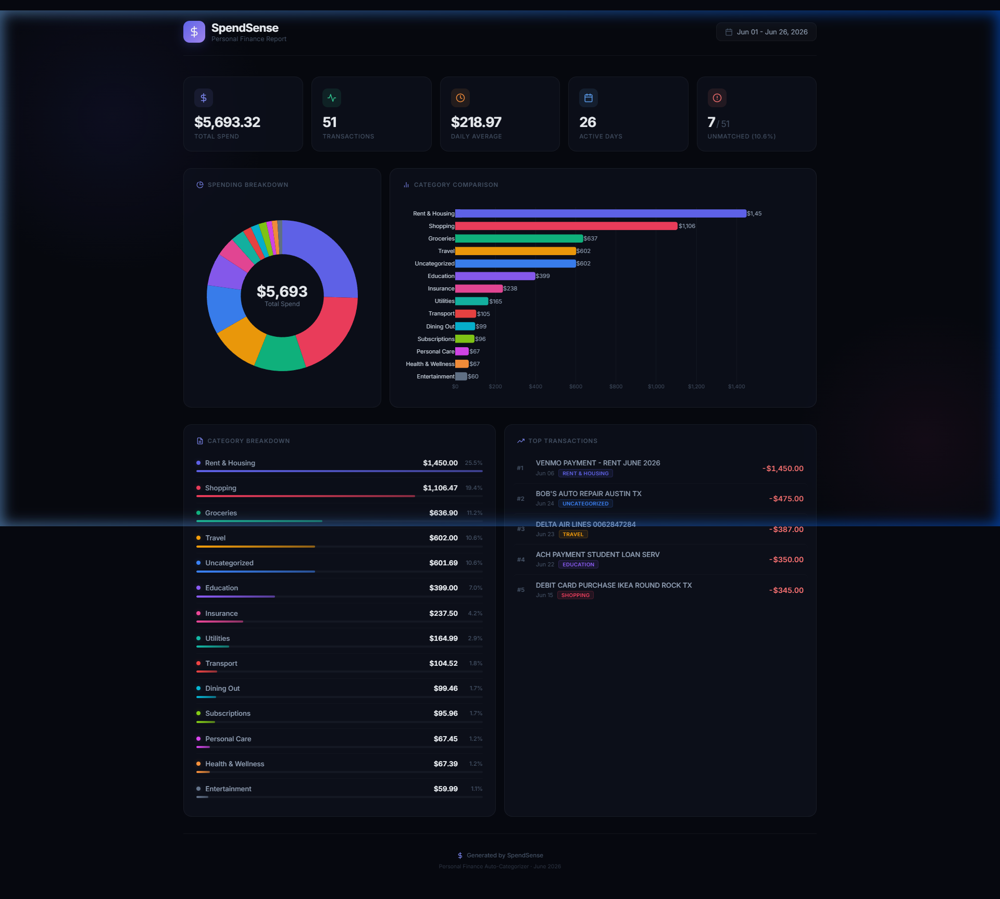

<div align="center">

# 💰 SpendSense

### Personal Finance Auto-Categorizer

**Ingest raw bank statements. Auto-categorize every transaction. Visualize your spending — instantly.**

[](https://python.org)
[](LICENSE)
[](https://pandas.pydata.org)
[](https://plotly.com)

---

*Stop wasting hours manually sorting bank transactions. SpendSense reads your messy CSV/Excel bank export, cleans up merchant names with regex, matches them to budget categories via a configurable rule engine, and generates a beautiful interactive dashboard — all in one command.*

</div>

---

## 📸 Report Preview

<div align="center">



*Interactive HTML report generated from a sample bank statement*

</div>

---

## ✨ Features

| Feature | Description |
|---------|-------------|
| 🏦 **Smart Data Ingestion** | Handles CSV and Excel files with case-insensitive column matching across 20+ bank format aliases |
| 🧹 **Regex-Powered Cleaning** | 7 regex patterns strip POS codes, merchant IDs, transaction numbers, and zip codes from raw descriptions |
| 🏷️ **Configurable Rule Engine** | JSON-based keyword → category mappings with 165+ keywords across 13 budget categories |
| 🤖 **Agentic & Self-Improving** | Gemini-powered fallback for uncategorized rows that writes new rules back to config — learning over time |
| 📊 **Interactive Reports** | Plotly-powered dark-themed dashboard with donut chart, bar chart, KPI cards, progress bars, and transaction details |
| 🛡️ **Production Quality** | Custom exception hierarchy, structured logging, and defensive error handling — never crashes on bad data |
| ⚡ **Zero Config** | Works out of the box with sensible defaults; just point it at your bank statement |

---

## 🤖 Agentic Mode (Self-Improving Rules)

SpendSense supports a self-improving categorization workflow using Google Gemini:
1. **Rule-Based First**: Spendsense runs the fast local regex engine to match keywords (zero API calls, maximum speed).
2. **Gemini Fallback**: Any remaining `Uncategorized` rows are batched and classified using the Google GenAI SDK (`gemini-2.5-flash`) with structured output.
3. **Automatic Rule Learning**: The Gemini Agent automatically proposes general keyword patterns (e.g., matching `'uber'` from `'UBER *TRIP 123'`) and updates your `config/categories.json` rules file.
4. **Zero-API Future Runs**: Next time you run SpendSense on similar transactions, they are categorized locally by the newly learned rules — keeping cost near $0 and performance lightning fast.

### Setup and Usage
1. Create a `.env` file in the root of the project:
   ```env
   GEMINI_API_KEY=your_gemini_api_key_here
   ```
2. Run as usual:
   ```bash
   python main.py --file statement.csv
   ```
   *Note: Pass `--no-agentic` to disable fallback calls, or `--agentic` to force it.*

---

## 🚀 Quick Start

### Prerequisites

- Python 3.11 or higher
- pip (Python package manager)

### Installation

```bash
# Clone the repository
git clone https://github.com/yourusername/spendsense.git
cd spendsense

# Create a virtual environment (recommended)
python -m venv .venv

# Activate it
# Windows:
.venv\Scripts\activate
# macOS/Linux:
source .venv/bin/activate

# Install dependencies
pip install -r requirements.txt
```

### Run with Sample Data

```bash
python main.py --file sample_data/sample_statement.csv
```

This generates an interactive HTML report at `output/spending_report_YYYY-MM.html`. Open it in any browser.

### Run with Your Own Bank Statement

```bash
python main.py --file path/to/your/bank_statement.csv
```

That's it. SpendSense auto-detects your columns and categorizes everything.

---

## ⚙️ CLI Reference

```bash
python main.py --file <path> [--config <path>] [--output <dir>]
```

| Option | Short | Default | Description |
|--------|-------|---------|-------------|
| `--file` | `-f` | *Required* | Path to bank statement (`.csv` or `.xlsx`) |
| `--config` | `-c` | `config/categories.json` | Path to category rules JSON file |
| `--output` | `-o` | `output/` | Output directory for generated reports |

### Examples

```bash
# Basic usage
python main.py --file statement.csv

# Custom category rules
python main.py --file statement.csv --config my_rules.json

# Custom output directory
python main.py --file statement.xlsx --output reports/june/
```

---

## 📊 Expected Input Format

Your bank statement needs at least 3 columns. SpendSense is flexible — it matches columns case-insensitively against known aliases:

| Required Field | Accepted Column Names |
|---------------|----------------------|
| **Date** | `Date`, `Transaction Date`, `Trans Date`, `Posting Date`, `Value Date` |
| **Description** | `Description`, `Payee`, `Merchant`, `Narration`, `Details`, `Memo`, `Particulars` |
| **Amount** | `Amount`, `Debit Amount`, `Transaction Amount`, `Value`, `Debit`, `Withdrawal` |

> **Note:** Currency symbols (`$`, `£`, `€`, `₹`) and commas are automatically stripped from amounts. All amounts are converted to absolute values for expense analysis.

### Sample Input

```csv
Date,Description,Amount
2026-06-01,POS DEBIT WALMART SUPERCENTER #4528 AUSTIN TX,87.43
2026-06-01,UBER *TRIP 8374829 SAN FRANCISCO CA,24.50
2026-06-02,ACH PAYMENT NETFLIX.COM 800-585-8018,15.99
```

---

## 🏷️ Customizing Categories

Edit [`config/categories.json`](config/categories.json) to add keywords or create new categories — no code changes needed:

```json
{
  "categories": {
    "Groceries": ["walmart", "kroger", "whole foods", "trader joe"],
    "Dining Out": ["mcdonalds", "starbucks", "chipotle"],
    "My Custom Category": ["keyword1", "keyword2"]
  },
  "default_category": "Uncategorized"
}
```

**How matching works:**
- Keywords are matched as **case-insensitive substrings** against cleaned descriptions.
- Longer keywords are matched first (e.g., `"amazon prime"` matches before `"amazon"`).
- Unmatched transactions fall into the `default_category`.

---

## 🏗️ Architecture

```
┌─────────────────┐     ┌─────────────────┐     ┌─────────────────┐
│   DATA LOADER   │────▶│  CATEGORIZER    │────▶│    REPORTER     │
│                 │     │                 │     │                 │
│ • Load CSV/XLSX │     │ • Load JSON     │     │ • Compute       │
│ • Match columns │     │   rules         │     │   analytics     │
│ • Validate data │     │ • Regex clean   │     │ • Generate      │
│ • Coerce types  │     │ • Keyword match │     │   Plotly HTML   │
└─────────────────┘     └─────────────────┘     └─────────────────┘
        ▲                       ▲                       │
        │                       │                       ▼
   Bank Statement        categories.json         HTML Report
   (CSV / Excel)                               (Interactive)
```

### Module Breakdown

| Module | Responsibility |
|--------|---------------|
| [`data_loader.py`](spendsense/data_loader.py) | File I/O, column alias matching, type coercion, validation |
| [`categorizer.py`](spendsense/categorizer.py) | Regex description cleaning, length-sorted keyword matching |
| [`reporter.py`](spendsense/reporter.py) | Analytics aggregation, Plotly HTML dashboard generation |
| [`exceptions.py`](spendsense/exceptions.py) | Custom exception hierarchy (6 exception classes) |
| [`logger.py`](spendsense/logger.py) | Centralized logging with UTF-8 support |
| [`main.py`](main.py) | CLI entry point, pipeline orchestration |

---

## 📁 Project Structure

```
spendsense/
├── .github/
│   └── ISSUE_TEMPLATE/
│       ├── bug_report.yml          # Bug report template
│       └── feature_request.yml     # Feature request template
├── spendsense/                     # Core application package
│   ├── __init__.py                 # Package init, version, public API
│   ├── exceptions.py               # Custom exception hierarchy
│   ├── data_loader.py              # Data ingestion & validation
│   ├── categorizer.py              # Rule-based categorization engine
│   ├── reporter.py                 # Analytics & visual reporting
│   └── logger.py                   # Centralized logging config
├── config/
│   └── categories.json             # Keyword → category mappings (editable)
├── sample_data/
│   └── sample_statement.csv        # 51-row demo bank statement
├── docs/
│   └── screenshots/
│       └── report_preview.png      # Report screenshot for README
├── output/                         # Generated reports (gitignored)
├── main.py                         # CLI entry point
├── pyproject.toml                  # Package metadata & tool config
├── requirements.txt                # Pinned dependencies
├── CHANGELOG.md                    # Version history
├── CONTRIBUTING.md                 # Contribution guidelines
├── LICENSE                         # MIT License
└── README.md                       # This file
```

---

## 🛡️ Error Handling

SpendSense never crashes on bad data. Every error produces an actionable message:

| Exception | When It Fires |
|-----------|--------------|
| `FileFormatError` | File is not `.csv` or `.xlsx` |
| `MissingColumnError` | Required columns not found (lists what's missing and what's available) |
| `DataValidationError` | All dates or amounts are unparseable |
| `EmptyDatasetError` | Zero valid rows remain after cleaning |
| `ConfigError` | Category JSON is missing, malformed, or has invalid schema |

```
❌ Missing required column(s): ['description']. Available columns: ['Date', 'Narr', 'Amt'].
   Please ensure your statement contains: Date, Description/Payee, Amount.
```

---

## 📋 Console Output

SpendSense logs every step of the pipeline so you always know what's happening:

```
[2026-06-30 15:17:03] [INFO   ] spendsense.main: SpendSense v1.0.0 — Personal Finance Auto-Categorizer
[2026-06-30 15:17:03] [INFO   ] spendsense.data_loader: Raw file loaded: 51 rows, 3 columns
[2026-06-30 15:17:03] [INFO   ] spendsense.data_loader: Column mapping applied: {'date': 'Date', 'description': 'Description', 'amount': 'Amount'}
[2026-06-30 15:17:03] [INFO   ] spendsense.data_loader: Data ingestion complete: 51 valid transactions loaded
[2026-06-30 15:17:03] [INFO   ] spendsense.categorizer: Loaded 165 keywords across 13 categories
[2026-06-30 15:17:03] [INFO   ] spendsense.categorizer: Categorization complete: 44 categorized, 7 uncategorized
[2026-06-30 15:17:03] [WARNING] spendsense.categorizer: Uncategorized transactions (7): ['UBER *TRIP 8374829...']
[2026-06-30 15:17:04] [INFO   ] spendsense.pipeline: PIPELINE COMPLETE
[2026-06-30 15:17:04] [INFO   ] spendsense.pipeline: Total Spend:       $5,693.32
[2026-06-30 15:17:04] [INFO   ] spendsense.pipeline: Transactions:      51
[2026-06-30 15:17:04] [INFO   ] spendsense.pipeline: Categories:        14
[2026-06-30 15:17:04] [INFO   ] spendsense.pipeline: Uncategorized:     7 (10.6%)
```

---

## 🤝 Contributing

Contributions are welcome! Please see [CONTRIBUTING.md](CONTRIBUTING.md) for guidelines.

The easiest way to contribute is by adding keywords to [`config/categories.json`](config/categories.json) to improve categorization coverage.

---

## 📄 License

This project is licensed under the MIT License — see the [LICENSE](LICENSE) file for details.

---

## 🗺️ Roadmap

- [ ] **Multi-currency support** — Detect and convert currencies automatically
- [ ] **ML-based categorization** — Train on user corrections for smarter matching
- [ ] **PDF statement parsing** — Extract transactions from PDF bank statements
- [ ] **Monthly comparison** — Side-by-side comparison across multiple months
- [ ] **Budget alerts** — Set spending limits per category with warnings
- [ ] **Export to CSV** — Export categorized data back to CSV/Excel

---

<div align="center">

**Built with Python, Pandas, and Plotly**

⭐ Star this repo if SpendSense saved you time!

</div>
